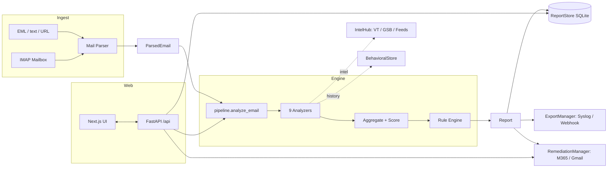
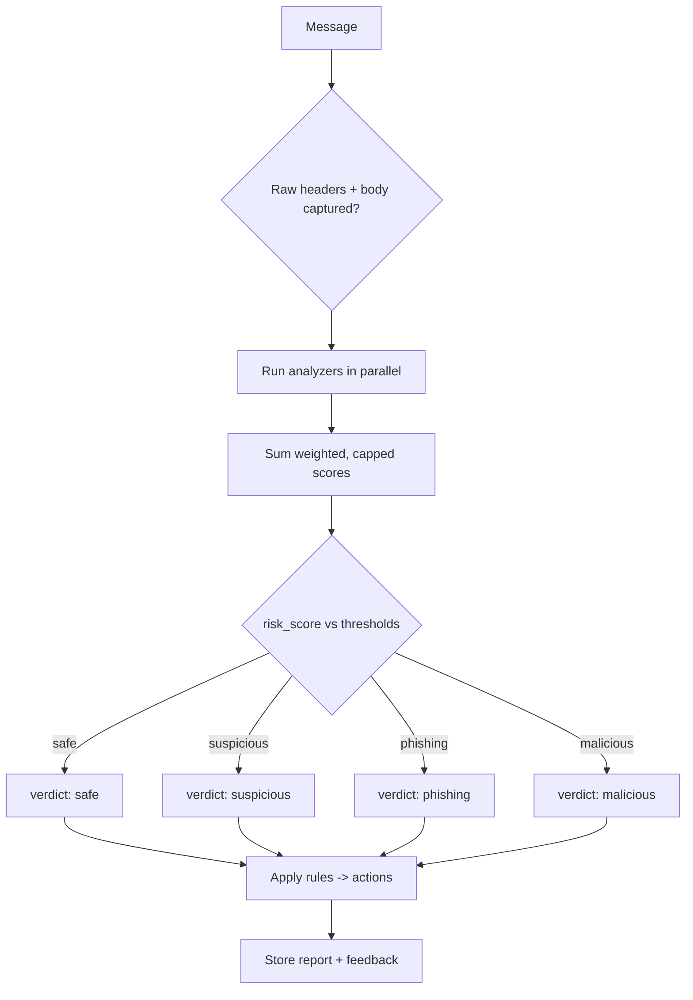

# PhishGuard

<p align="center">
  
</p>

<p align="center">
  <b>Self-hosted · offline-first email phishing detection & analysis engine</b><br/>
  Transparent, weighted, auditable verdicts — CLI + full web control plane.
</p>

An industrial-grade, **self-hosted, offline-first** email phishing detection & analysis
engine with a CLI and a full web control plane. PhishGuard is built to be **auditable and
transparent**: every verdict is explained by weighted, capped signals — no black boxes.

> **Honest positioning:** PhishGuard aims to be the best *open / self-hosted / auditable*
> detection engine, not a claim to beat the top-1% commercial vendors (Abnormal, Defender,
> Proofpoint) at global scale. Its behavioral BEC signal is a strong second-line detector
> based on *your* mail, not a cross-tenant network effect.

---

## Features

- **Detection engine first.** 9 transparent analyzers:
  `header_auth` (SPF/DKIM/DMARC + alignment), `header_analysis` (reply-to/return-path/
  message-id mismatches, VIP display-name impersonation), `domain_reputation` (lookalike/
  disposable/newly-registered domains), `org_context` (brand-in-display + your-domain
  lookalike), `url_scanner` (IP hosts, suspicious TLDs, shorteners, display/text mismatch,
  brand lookalikes, threat-intel hits), `content_analyzer` (urgency/authority/credential/
  financial cues, external HTML forms, obfuscation), `attachment_analyzer` (executables,
  macro Office docs, double extensions, HTML, hash reputation), `behavioral` (first-contact
  BEC anomaly), `sandbox` (ClamAV INSTREAM / hash reputation).
- **Transparent scoring.** Weighted signals → `risk_score` 0–100 → `safe / suspicious /
  phishing / malicious` (thresholds configurable). Detections-as-code rule engine maps
  findings to recommended actions (quarantine, notify_soc, review, train_user, …).
- **Self-contained, optional APIs.** Works with **zero external APIs**. VirusTotal,
  Google Safe Browsing, ClamAV and free feeds (URLhaus/OpenPhish) are optional and degrade
  gracefully.
- **Web control plane.** A modern Next.js (React/TypeScript/Tailwind) console backed by a
  FastAPI JSON service. Dashboard, Reports (+ analyst feedback), Scan (EML/text/URL),
  Mailbox (configure IMAP + Scan now + scheduled monitor), Feeds, Org Profile, Rules,
  Remediation, SIEM Export, and full Settings — all configurable from the browser; config
  is persisted to `.env` and shared with the CLI.
- **Persistence & export.** SQLite report store with feedback; SIEM export via syslog
  (CEF or JSON) and webhook.
- **Post-delivery remediation.** Optional M365 (Graph) / Gmail move-to-junk / soft-delete
  / notify. This is **post-delivery only**, not a pre-delivery gateway.

---

## Architecture

PhishGuard is a single binary that runs the detection pipeline and serves the web UI on one
port. The pipeline is fully synchronous and local; only the *optional* enrichment integrations
(IntelHub) reach out — and only when configured.



### Detection pipeline



Each analyzer implements `analyze(email, ctx) -> AnalyzerResult(score, findings)`;
`pipeline.analyze_email` runs them, aggregates, builds a `Report`, and applies rules.

---

## Installation

```bash
pip install .[dev]        # includes pytest, ruff, mypy
cp .env.example .env      # then fill in values (see Configuration)
```

Python 3.10+.

## Configuration

All settings are environment variables (or a `.env` file). See `.env.example`. Key groups:
IMAP mailbox, VirusTotal / Google Safe Browsing, ClamAV / sandbox, monitor, behavioral,
org profile path, web dashboard, storage, remediation, SIEM export, and engine thresholds.
**Body text never leaves the box** when no external APIs are enabled.

| Group | Example variables |
| --- | --- |
| Mailbox | `PG_IMAP_SERVER`, `PG_IMAP_USERNAME`, `PG_IMAP_PASSWORD`, `PG_IMAP_MAILBOX`, `PG_IMAP_USE_SSL` |
| Enrichment | `PG_VT_API_KEY`, `PG_GSB_API_KEY`, `PG_CLAMAV_HOST`, `PG_SANDBOX_*` |
| Monitor | `PG_MONITOR_ENABLED`, `PG_MONITOR_INTERVAL` |
| Behavior | `PG_BEHAVIORAL_ENABLED`, `PG_BEHAVIORAL_BASELINE_DAYS` |
| Org | `PG_ORG_PROFILE_PATH`, `PG_TRUSTED_DOMAINS` |
| Web | `PG_WEB_HOST`, `PG_WEB_PORT`, `PG_WEB_USERNAME`, `PG_WEB_PASSWORD`, `PG_WEB_SECRET_KEY` |
| Engine | `PG_THRESHOLD_SUSPICIOUS`, `PG_THRESHOLD_PHISHING`, `PG_THRESHOLD_MALICIOUS` |

## CLI usage

```bash
phishguard scan-eml sample.phish.eml
phishguard scan-url https://paypa1.com/login
phishguard scan-text "urgent verify password http://paypa1.com/login"
phishguard scan-mailbox --all             # read-only IMAP scan of the ENTIRE mailbox
phishguard scan-mailbox --limit 50         # read-only IMAP scan (unseen only by default)
phishguard feeds                          # pull URLhaus + OpenPhish into cache
phishguard serve --host 127.0.0.1 --port 8080
```

The web dashboard is the recommended way to operate everything (configure mailbox, run
scans, start a monitor, manage org profile, rules, remediation, and export).

## Web dashboard (Next.js + FastAPI)

The UI is a static Next.js build served by the Python API on a **single port** — one
command starts everything:

```bash
phishguard serve --host 127.0.0.1 --port 8080
```

First run builds the UI automatically (installs `web/node_modules` and runs `next build`).
To build/preview manually:

```bash
phishguard web build     # install deps + static export to web/out
phishguard web dev       # live-reload Next dev server on :3000 (run `phishguard serve` separately for the API)
```

Open `http://127.0.0.1:8080`, log in with `PG_WEB_USERNAME` / `PG_WEB_PASSWORD`, and use the
nav to control every capability. The FastAPI JSON API lives under `/api` (`/api/dashboard`,
`/api/reports`, `/api/scan`, `/api/mailbox/scan`, `/api/feeds/update`, `/api/org`,
`/api/rules`, `/api/remediation`, `/api/export`, `/api/settings`, …).

> **Continuous monitor:** flip the *Continuous monitoring* toggle in **Settings** (or use the
> Start/Stop buttons on the **Mailbox** page). The toggle persists to `.env`, so monitoring
> auto-starts after a server restart.

## Docker

```bash
docker compose up --build     # serves the web UI on :8080
```

## Testing

```bash
python -m pytest -q
```

Covers every analyzer, scoring/rules, persistence, export, feeds, behavioral BEC, the IMAP
fetcher (mocked), the sandbox/remediation dry-paths, and the full web console (all pages
render; scan upload + feedback persist).

## Limitations / roadmap

- Single-admin auth (no RBAC yet); rules are view-only in the UI (edit `rules/defaults.py`).
- Behavioral BEC uses a local baseline (your org only), not a cross-tenant network effect.
- Remediation requires provider credentials and is post-delivery only.

## Credits

**Coded by [@iampopg](https://github.com/iampopg).**

PhishGuard is open-source under the MIT license. Contributions, detections-as-code rules,
and analyzer improvements are welcome.

## License

MIT.
