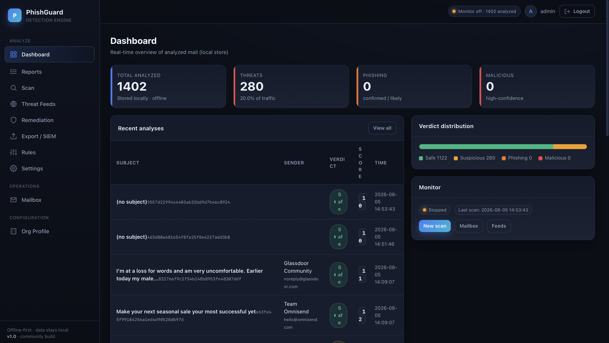
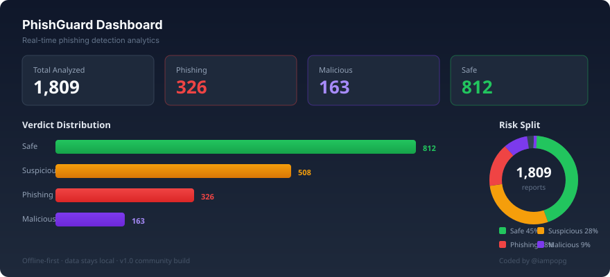
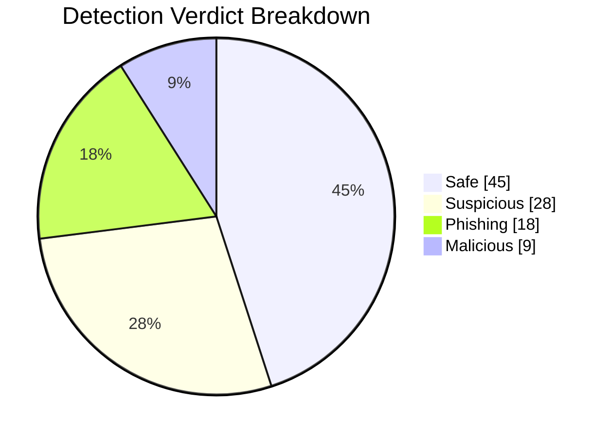
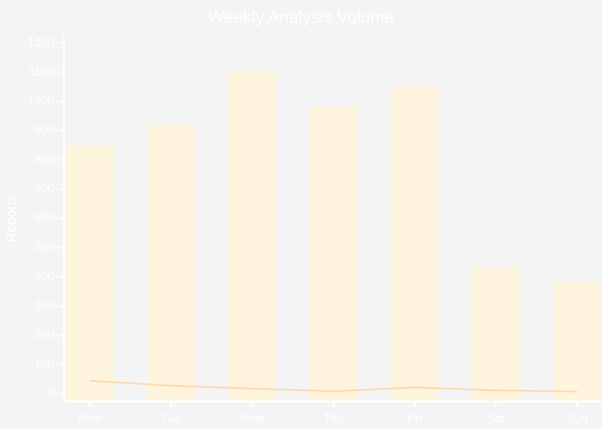
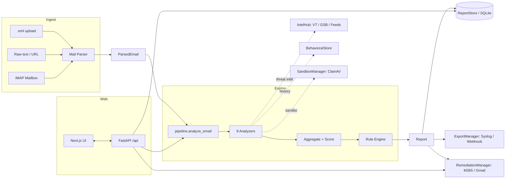
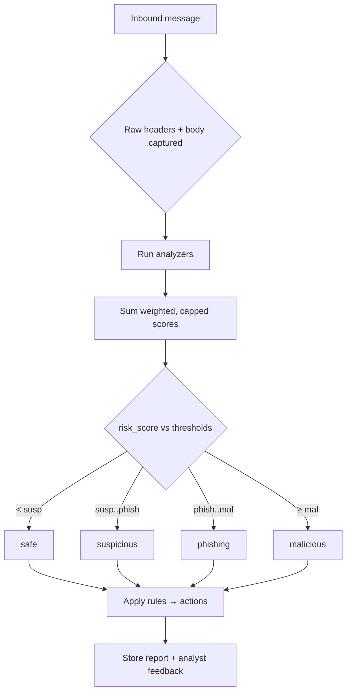

# PhishGuard

<p align="center">
  
</p>

<p align="center">
  
</p>

<p align="center">
  <a href="https://github.com/iampopg/PhishGuard/stargazers"></a>
  
  
  
  <a href="https://github.com/iampopg/PhishGuard"></a>
  
</p>

> **⚠️ Project status: in development (beta).** The detection engine, CLI, and web dashboard
> work, but some features are **not yet functional** — in particular **Remediation**
> (M365 / Gmail move / delete / notify) is not implemented yet (the UI exists, but actions are
> currently no-ops). See [Known limitations](#limitations--roadmap).

<p align="center">
  <b>Self-hosted · offline-first email phishing detection &amp; analysis engine</b><br/>
  Transparent, weighted, auditable verdicts — a powerful CLI <i>and</i> a full web control plane.
</p>

---

## Table of contents

- [Overview](#overview)
- [Why PhishGuard](#why-phishguard)
- [Feature tour](#feature-tour)
- [Architecture](#architecture)
- [Detection pipeline](#detection-pipeline)
- [Project structure](#project-structure)
- [Requirements](#requirements)
- [Installation](#installation)
- [Configuration](#configuration)
- [Usage — CLI](#usage--cli)
- [Usage — Web dashboard](#usage--web-dashboard)
- [AI Assistant](#ai-assistant)
- [Sender reputation &amp; trust](#sender-reputation--trust)
- [Forensic observables &amp; PDF reporting](#forensic-observables--pdf-reporting)
- [Analyzers](#analyzers)
- [Scoring & thresholds](#scoring--thresholds)
- [REST API](#rest-api)
- [Continuous monitoring](#continuous-monitoring)
- [Org profile &amp; BEC defense](#org-profile--bec-defense)
- [Remediation &amp; SIEM export](#remediation--siem-export)
- [Docker](#docker)
- [Testing](#testing)
- [Security &amp; privacy](#security--privacy)
- [Roadmap](#roadmap)
- [Contributing](#contributing)
- [License](#license)
- [Credits](#credits)

---

## Overview

**PhishGuard** is an industrial-grade, self-hosted, **offline-first** email phishing
detection and analysis engine. It ingests messages (uploaded `.eml` files, raw text, URLs,
or a live IMAP mailbox), runs them through a stack of transparent analyzers, and produces a
**fully explained verdict** — every score is the sum of capped, weighted signals, never a
black box.

It ships in two forms that share the same engine:

1. A **command-line interface** (`phishguard …`) for automation and pipelines.
2. A **modern web console** (Next.js + TypeScript + Tailwind) served by a FastAPI backend on
   a **single port** — one command starts the whole stack.

> ### Why PhishGuard
>
> Most phishing tooling is either a closed commercial appliance or a thin wrapper around a
> single vendor API. PhishGuard is built to be the **best open / self-hosted / auditable**
> detection engine: you can read exactly *why* a message was flagged, tune it to your
> organization, and run it without sending a single byte of mail to a third party.
>
> **Honest positioning:** PhishGuard does **not** claim to beat the top-1% commercial vendors
> (Abnormal, Microsoft Defender, Proofpoint) at global scale. Its behavioral BEC signal is a
> strong *second-line* detector based on **your** mail, not a cross-tenant network effect.
> Where it shines is transparency, control, and cost.

---

## Feature tour

### Detection Engine Coverage

```mermaid
xybar-chart
    title "Analyzer Detection Coverage"
    x-axis ["Header Auth" , "Domain Rep", "URL Scanner", "Content", "Attachment", "Behavioral", "Org Context", "Sandbox"]
    y-axis "Max Score" 0 --> 30
    bar [20, 18, 20, 15, 12, 18, 10, 8]
    bar [12, 0, 0, 0, 0, 12, 0, 0]
```

### Verdict Distribution



### Weekly Threat Volume



- **Detection engine first.** Nine transparent analyzers covering headers, authentication,
  domains, org context, URLs, content, attachments, behavior, and sandboxing.
- **Transparent scoring.** Weighted, capped signals → `risk_score` 0–100 → `safe /
  suspicious / phishing / malicious` (thresholds are configurable). A detections-as-code rule
  engine maps findings to recommended actions.
- **Self-contained, optional enrichment.** Runs with **zero external APIs**. VirusTotal,
  Google Safe Browsing, ClamAV and free threat feeds (URLhaus / OpenPhish) are strictly
  optional and degrade gracefully.
- **Full web control plane.** Dashboard, Reports (with analyst feedback), Scan, Mailbox
  (IMAP config + one-shot scan + scheduled monitor), Threat Feeds, Org Profile, Rules,
  Remediation, SIEM Export, and Settings — all configurable from the browser; config is
  persisted to `.env` and shared with the CLI.
- **Persistence & export.** SQLite report store with analyst feedback; SIEM export via syslog
  (CEF or JSON) and webhook.
- **Continuous monitoring.** A background thread periodically scans your inbox; toggled from
  the UI and persisted across restarts.
- **Post-delivery remediation.** Optional Microsoft 365 (Graph) / Gmail move-to-junk,
  soft-delete, or notify. **Post-delivery only** — not a pre-delivery gateway.

---

## Architecture

PhishGuard is a single Python process. The detection pipeline is fully synchronous and local;
only the *optional* enrichment integrations (`IntelHub`) make outbound calls, and only when
explicitly configured. The web UI is a static Next.js build served by the same process.



### Detection pipeline



Each analyzer implements `analyze(email, ctx) -> AnalyzerResult(score, findings)`;
`pipeline.analyze_email` runs them, aggregates, builds a `Report`, and applies rules.

---

## Project structure

```text
PhishGuard/
├── phishguard/                 # Python engine + CLI
│   ├── api/                    # FastAPI backend (serves UI + /api)
│   ├── engines/                # 9 analyzers + IntelHub
│   ├── mail/                   # IMAP fetcher + RFC-compliant parser
│   ├── rules/                  # detections-as-code engine + defaults
│   ├── models.py               # Report / ParsedEmail / Attachment
│   ├── config.py               # typed Config from env
│   ├── config_store.py        # .env load/persist
│   ├── pipeline.py             # analyze_email orchestration
│   └── cli.py                  # phishguard … commands
├── web/                        # Next.js 14 UI (App Router)
│   ├── app/                    # pages (dashboard, reports, scan, …)
│   ├── components/             # Shell, AuthProvider, ui
│   └── lib/                    # api client, types
├── docs/                       # planning + assets (screenshots)
├── tests/                      # pytest suite
├── .env.example                # all configuration keys
├── README.md
└── pyproject.toml
```

---

## Requirements

| Component | Version / note |
| --- | --- |
| Python | **3.10+** |
| Node.js | **18+** (only needed to build the web UI; `serve` builds it automatically) |
| pip | latest |
| OS | Linux / macOS / Windows (WSL recommended on Windows) |
| External accounts (optional) | IMAP mailbox; VirusTotal / Google Safe Browsing keys; ClamAV host |

No database server, message broker, or container runtime is required for core operation.

---

## Installation

### 1. Clone the repository

```bash
git clone https://github.com/iampopg/PhishGuard.git
cd PhishGuard
```

### 2. Create a virtual environment (recommended)

```bash
python3 -m venv .venv
source .venv/bin/activate          # Windows: .venv\Scripts\activate
```

### 3. Install PhishGuard

```bash
pip install --upgrade pip
pip install -e .[dev]               # [dev] adds pytest, ruff, mypy
```

### 4. Configure environment

```bash
cp .env.example .env
```

Open `.env` and set at least:

- `PG_WEB_USERNAME` / `PG_WEB_PASSWORD` — web login.
- `PG_WEB_SECRET_KEY` — a long random string (session signing).
- `PG_IMAP_SERVER` / `PG_IMAP_USERNAME` / `PG_IMAP_PASSWORD` — your mailbox.
- (Optional) `PG_VT_API_KEY`, `PG_GSB_API_KEY`, `PG_CLAMAV_HOST`, …

> **Tip:** every value can also be changed later from the web **Settings** page; the UI
> writes back to `.env` for you.

### 5. Build the web UI (optional — done automatically on first `serve`)

```bash
phishguard web build              # installs web/node_modules + static export to web/out
```

### 6. Start PhishGuard

```bash
phishguard serve --host 127.0.0.1 --port 8080
```

On first run `serve` will build the UI if `web/out` is missing. Open
**http://127.0.0.1:8080**, log in, and you're ready.

---

## Configuration

All settings are environment variables (or keys in `.env`). They are grouped below; the full
list lives in `.env.example`.

| Group | Key variables | Purpose |
| --- | --- | --- |
| **Web** | `PG_WEB_HOST`, `PG_WEB_PORT`, `PG_WEB_USERNAME`, `PG_WEB_PASSWORD`, `PG_WEB_SECRET_KEY` | Dashboard bind + auth |
| **Mailbox** | `PG_IMAP_SERVER`, `PG_IMAP_PORT`, `PG_IMAP_USERNAME`, `PG_IMAP_PASSWORD`, `PG_IMAP_MAILBOX`, `PG_IMAP_USE_SSL`, `PG_IMAP_UNSEEN_ONLY`, `PG_IMAP_MARK_READ` | Read-only IMAP scanning |
| **Enrichment** | `PG_VT_API_KEY`, `PG_GSB_API_KEY`, `PG_CLAMAV_HOST`, `PG_CLAMAV_PORT`, `PG_SANDBOX_PROVIDER`, `PG_SANDBOX_API_KEY`, `PG_SANDBOX_URL` | Optional threat intel |
| **Monitor** | `PG_MONITOR_ENABLED`, `PG_MONITOR_INTERVAL` | Background inbox watcher |
| **Behavior** | `PG_BEHAVIORAL_ENABLED`, `PG_BEHAVIORAL_BASELINE_DAYS` | Local BEC baseline |
| **Org** | `PG_ORG_PROFILE_PATH`, `PG_TRUSTED_DOMAINS` | Brand / VIP / trusted domains |
| **Export** | `PG_EXPORT_ENABLED`, `PG_EXPORT_CEF`, `PG_EXPORT_SYSLOG_ADDR`, `PG_EXPORT_WEBHOOK_URL`, `PG_EXPORT_MIN_SEVERITY` | SIEM forwarding |
| **Remediation** | `PG_REMEDIATION_ENABLED`, `PG_REMEDIATION_PROVIDER`, `PG_M365_*`, `PG_GMAIL_SA_JSON` | Post-delivery actions |
| **Engine** | `PG_THRESHOLD_SUSPICIOUS`, `PG_THRESHOLD_PHISHING`, `PG_THRESHOLD_MALICIOUS`, `PG_DNS_CHECKS_ENABLED` | Scoring thresholds |

**Privacy note:** when no external enrichment keys are set, message bodies and headers never
leave your machine — detection is 100% local.

---

## Usage — CLI

```bash
# Analyze a downloaded message
phishguard scan-eml sample.phish.eml

# Analyze a single URL or raw text
phishguard scan-url https://paypa1.com/login
phishguard scan-text "urgent: verify your password http://paypa1.com/login"

# Read-only IMAP scanning
phishguard scan-mailbox --all        # scan the ENTIRE mailbox
phishguard scan-mailbox --limit 50   # unseen only by default

# Threat intelligence feeds (URLhaus + OpenPhish)
phishguard feeds

# Run the web stack (auto-builds UI on first run)
phishguard serve --host 127.0.0.1 --port 8080
```

Use `phishguard --help` and `phishguard <command> --help` for all options.

---

## Usage — Web dashboard

The dashboard is the recommended way to operate everything. After `phishguard serve`, open
the URL and log in.

| Page | What it does |
| --- | --- |
| **Dashboard** | Verdict breakdown, trend, recent high-risk reports, monitor status |
| **Reports** | Searchable table; click a report for the full breakdown + Email viewer |
| **Scan** | Upload `.eml`, paste text, or enter a URL; see the report instantly |
| **Mailbox** | Configure IMAP, run a one-shot scan, or Start/Stop the monitor |
| **Threat Feeds** | Pull and inspect URLhaus / OpenPhish intelligence |
| **Org Profile** | Protected domains, VIP names, brand keywords/domains, trusted domains |
| **Rules** | Review detections-as-code mappings (findings → recommended actions) |
| **Remediation** | Configure post-delivery move/delete/notify actions |
| **Export / SIEM** | Syslog (CEF/JSON) and webhook forwarding |
| **Settings** | Every engine/enrichment/server knob; persisted to `.env` |

---

## AI Assistant

PhishGuard includes a multi-provider AI assistant that can analyze emails, explain verdicts,
and investigate your logs autonomously.

**Providers:** Local (Ollama), Google Gemini, Anthropic Claude, kilo.ai, or **auto** (picks the
best available). When Ollama is running locally it is detected automatically; otherwise set an
API key in Settings → AI.

| Endpoint | Purpose |
| --- | --- |
| `GET /api/ai/providers` | List providers, availability, and local models |
| `GET /api/ai/analyze/{id}?provider=auto&question=…` | Analyze a report (or `all`) and get a verdict explanation |

The **AI** page (`/ai`) provides a full chat interface with conversation history, model
selection, and a report picker — type *"investigate all phishing logs"* to let the AI summarize
your detections.

Configuration (`.env`):
```
PG_AI_LOCAL_URL=http://localhost:11434   # Ollama endpoint (auto-detected)
PG_AI_GEMINI_KEY=...
PG_AI_CLAUDE_KEY=...
PG_AI_KILO_KEY=...
```

---

## Sender reputation & trust

A SQLite-backed `SenderReputationStore` lets you mark senders as **trusted** or **malicious**.
Trusted senders that also pass SPF+DKIM+DMARC receive a negative trust bonus that offsets
false-positive contributions — this is the primary defense against bulk-mail false positives.

- One-click **"Trust sender"** / **"Mark malicious"** on each report
- Persists across restarts; survives reboots
- Keyed by registrable domain (whitelisting `taxact.com` covers all its addresses)

---

## Forensic observables & PDF reporting

Every analysis can extract **indicators of compromise** — URLs, domains, IPs, email addresses,
file hashes, and crypto wallet addresses — and enrich them across threat-intel providers.

| Endpoint | Purpose |
| --- | --- |
| `GET /api/forensics/ioc/{report_id}` | Extract IOCs from a report |
| `POST /api/forensics/enrich` | Enrich IOCs across enabled providers |
| `GET /api/forensics/evidence/{report_id}` | List preserved artifacts (raw eml, headers, body, screenshot) |
| `GET /api/reports/export-pdf?verdict=phishing&from=2026-01-01` | Download a branded, filtered PDF report |

The PDF report is generated with `reportlab`, includes verdict statistics and a color-coded
table, and is signed with `@iampopg` and the GitHub repository link.

---

## Analyzers

PhishGuard runs nine independent analyzers. Each emits findings with a `severity` and a
contribution to `risk_score`; the aggregator caps and sums them.

| Analyzer | Detects |
| --- | --- |
| `header_auth` | Missing / failing SPF, DKIM, DMARC; alignment failures |
| `header_analysis` | Reply-To / Return-Path mismatch, Message-ID anomalies, VIP display-name impersonation |
| `domain_reputation` | Lookalike / typosquat domains, disposable & newly-registered domains |
| `org_context` | Your brand in display name, lookalike of your own domains |
| `url_scanner` | IP-literal hosts, suspicious TLDs, URL shorteners, display-vs-text mismatch, brand lookalikes, threat-intel hits |
| `content_analyzer` | Urgency / authority / credential / financial lures, external HTML forms, obfuscation |
| `attachment_analyzer` | Executables, macro Office docs, double extensions, HTML, hash reputation (ClamAV / VT) |
| `behavioral` | First-contact BEC anomalies vs. a local baseline of sender behavior |
| `sandbox` | Optional ClamAV INSTREAM scan / hash reputation |
| `trust` | Sender reputation — negative bonus for trusted senders, boost for known-bad |
| `url_deep_scanner` | Follows redirects, resolves shorteners, detects credential-form landing pages |
| `calendar` | Suspicious `.ics` invites, urgent calendar language, lookalike calendar links |
| `qr_scanner` | QR codes in attachments — extracts embedded URLs for analysis |

---

## Scoring & thresholds

Each analyzer returns a score; the pipeline sums capped contributions into `risk_score`
(0–100). The verdict is assigned by three thresholds (all editable in Settings):

| Verdict | Condition |
| --- | --- |
| `safe` | `risk_score < PG_THRESHOLD_SUSPICIOUS` (default 25) |
| `suspicious` | suspicious ≤ score < phishing (default 50) |
| `phishing` | phishing ≤ score < malicious (default 75) |
| `malicious` | score ≥ malicious (default 90) |

Analyst feedback (true/false positive, benign, malicious) is stored per report to tune future
review.

---

## REST API

The FastAPI backend exposes a JSON API under `/api` (Bearer-token auth). Highlights:

| Method | Path | Purpose |
| --- | --- | --- |
| POST | `/api/login` | Obtain a bearer token |
| GET | `/api/dashboard` | Aggregate stats |
| GET | `/api/reports` | List reports |
| GET | `/api/report/{id}` | Full report + feedback |
| POST | `/api/scan` | Scan eml/text/url |
| POST | `/api/mailbox/scan` | Scan IMAP (limit / all) |
| POST | `/api/mailbox/monitor/start` · `/stop` | Control the monitor |
| GET | `/api/feeds/update` | Refresh threat feeds |
| GET/POST | `/api/org` | Read / write org profile |
| GET/POST | `/api/settings` | Read / write configuration |
| GET | `/api/status` | Monitor status + totals |

The interactive OpenAPI docs are available at `/docs` when the server is running.

---

## Continuous monitoring

Flip the **Continuous monitoring** toggle in **Settings** (or use Start/Stop on the
**Mailbox** page). The server spawns a background thread that periodically fetches unseen
messages, scores them, and stores reports. The toggle **persists to `.env`**, so monitoring
automatically resumes after a server restart. The top-bar pill reflects the live state.

---

## Org profile & BEC defense

`POST /api/org` (or the **Org Profile** page) captures:

- **Protected domains** — your real domains (used to flag lookalikes).
- **VIP names** — executives whose display names are commonly impersonated.
- **Brand keywords / domains** — terms attackers spoof.
- **Trusted domains** — allow-listed senders.

These feed `org_context`, `domain_reputation`, and `header_analysis` to cut false positives
and catch spear-phishing / BEC that generic engines miss. `behavioral` adds a local
first-contact baseline.

---

## Remediation & SIEM export

- **Export:** forward every report (above `PG_EXPORT_MIN_SEVERITY`) to syslog as **CEF** or
  **JSON**, or to an HTTP **webhook** — ready for Splunk / Sentinel / Elastic.
- **Remediation:** optionally move messages to Junk, soft-delete, or notify, via Microsoft 365
  Graph or Gmail API. This is **post-delivery only**.

---

## Docker

```bash
docker compose up --build     # serves the web UI on :8080
```

Mount a persistent volume for `reports/` (the SQLite store) if you want history to survive
container recreation, and pass your `.env` via `environment:` or a secrets file.

---

## Testing

```bash
python -m pytest -q
```

The suite covers every analyzer, scoring and rules, persistence, export, feeds, behavioral
BEC, the IMAP fetcher (mocked), sandbox/remediation dry-paths, and the full web console (all
pages render; scan upload + feedback persist).

---

## Security & privacy

- **Offline-first.** With no enrichment keys configured, no message content is transmitted.
- **Read-only mailbox access.** Scanning never modifies or sends mail (mark-as-read is opt-in).
- **Secrets stay local.** Credentials live in a git-ignored `.env`; the report store keeps
  only extracted headers/body/metadata, never the raw `.eml`.
- **Single-admin auth.** The web UI uses a bearer token; rotate `PG_WEB_SECRET_KEY` regularly.

---

## Known limitations

- **Remediation is not yet implemented.** The Remediation page and settings exist, but the
  Microsoft 365 (Graph) and Gmail move / delete / notify actions are currently no-ops.
- Rules are view-only in the UI (edit `rules/defaults.py` to change them).
- Behavioral BEC uses a local baseline (your org only), not a cross-tenant network effect.
- Sandbox / ClamAV and VirusTotal / Google Safe Browsing enrichment are optional and require
  your own keys/host; without them detection runs fully locally.

## Roadmap

- [ ] Multi-user / RBAC
- [ ] Editable rules from the UI (currently `rules/defaults.py`)
- [ ] Cross-tenant behavioral network effect (opt-in, federated)
- [ ] Pre-delivery gateway mode (Milter / Exchange transport agent)
- [ ] More sandboxes (any.run, Joe Sandbox) and EDR correlation

---

## Contributing

Contributions are welcome — detectors-as-code rules, new analyzers, UI polish, docs. Please
open an issue to discuss direction, then a PR against `main`. Keep tests green
(`python -m pytest -q`) and run `ruff` before submitting.

---

## License

PhishGuard is released under the **MIT License**.

```text
MIT License

Copyright (c) 2026 @iampopg

Permission is hereby granted, free of charge, to any person obtaining a copy
of this software and associated documentation files (the "Software"), to deal
in the Software without restriction, including without limitation the rights
to use, copy, modify, merge, publish, distribute, sublicense, and/or sell
copies of the Software, and to permit persons to whom the Software is
furnished to do so, subject to the following conditions:

The above copyright notice and this permission notice shall be included in all
copies or substantial portions of the Software.

THE SOFTWARE IS PROVIDED "AS IS", WITHOUT WARRANTY OF ANY KIND, EXPRESS OR
IMPLIED, INCLUDING BUT NOT LIMITED TO THE WARRANTIES OF MERCHANTABILITY,
FITNESS FOR A PARTICULAR PURPOSE AND NONINFRINGEMENT. IN NO EVENT SHALL THE
AUTHORS OR COPYRIGHT HOLDERS BE LIABLE FOR ANY CLAIM, DAMAGES OR OTHER
LIABILITY, WHETHER IN AN ACTION OF CONTRACT, TORT OR OTHERWISE, ARISING FROM,
OUT OF OR IN CONNECTION WITH THE SOFTWARE OR THE USE OR OTHER DEALINGS IN THE
SOFTWARE.
```

---

## Credits

**Coded by [@iampopg](https://github.com/iampopg).**

If PhishGuard helps you, please **[star the project on GitHub](https://github.com/iampopg/PhishGuard)** —
it helps others discover transparent, self-hostable phishing defense.
